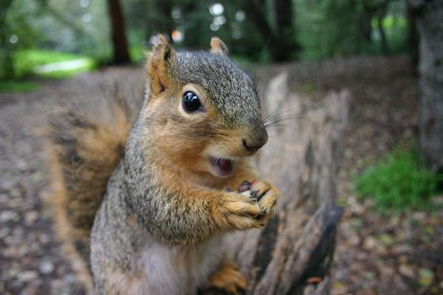
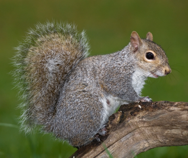
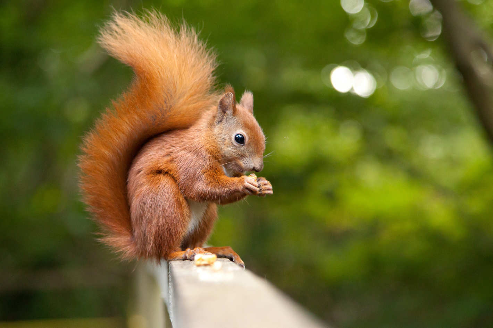
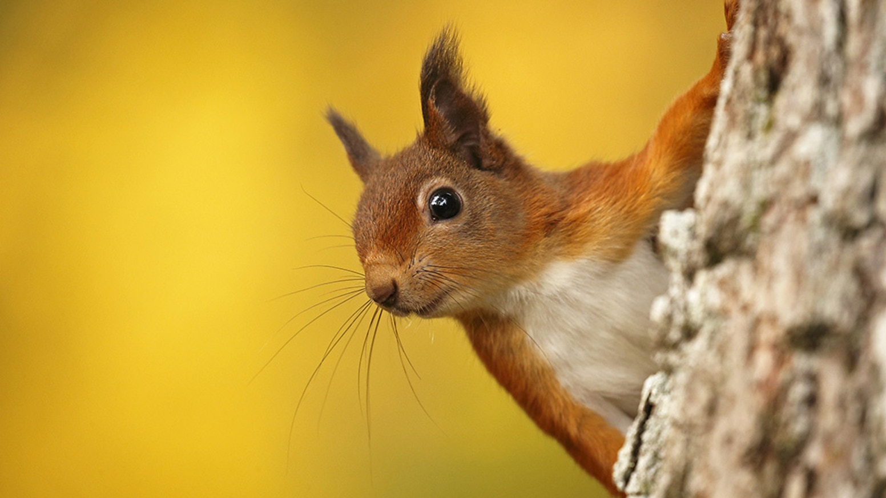

# gm-gallery
##### It's simple html and javascript gallery

<p align="center">
	
</p>

<p align="center">
	
</p>

<p align="center">
	
</p>

#### Firstly you have to import jQuery, gm-gallery.js, gm-gallery.css:

##### in head tag:

```html
	<link rel="stylesheet" type="text/css" href="css/gm-gallery.css">
	<script type="text/javascript" src="js/jquery-3.2.1.min.js"></script>
```

##### and before end of body tag  - ```</body>```

```html
	<script type="text/javascript" src="js/gm-gallery.js"></script>
```

Then create div:

```html
  <div id="gm-gallery" gm-arrows="true">
  
  </div>
```

##### with parameter "gm-arrows". You can set "true" or "false" it means visibility of arrows to next/prev image.

##### and then put image in gallery div. 
##### Such as:

```html
  <div id="gm-gallery" gm-arrows="true">
	
	
	
	
  </div>
```
  
## Tag "img" have 3 another parameters:

##### "gm-icon-size" - size of thumbnail image
##### "gm-open-size" - size of opened image
##### "gm-bg" - color of background image

## Values

### gm-icon-size:

```html
gm-icon-size="small"
gm-icon-size="medium"
gm-icon-size="large"
or in percentages gm-icon-size="40%"
```

### gm-open-size:

```html
gm-open-size="small"
gm-open-size="medium"
gm-open-size="large"
or in percentages gm-open-size="40%"
```

### gm-bg
```html
gm-bg="dark"
gm-bg="light"
```

